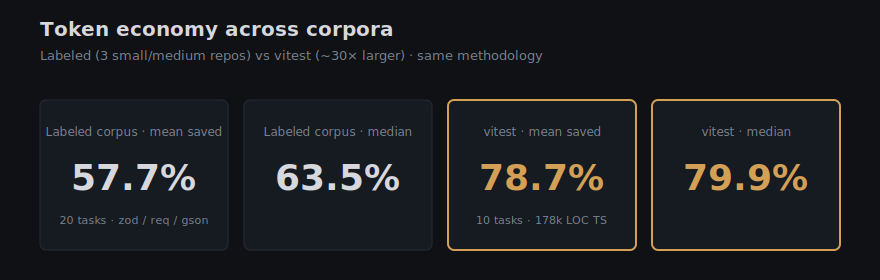
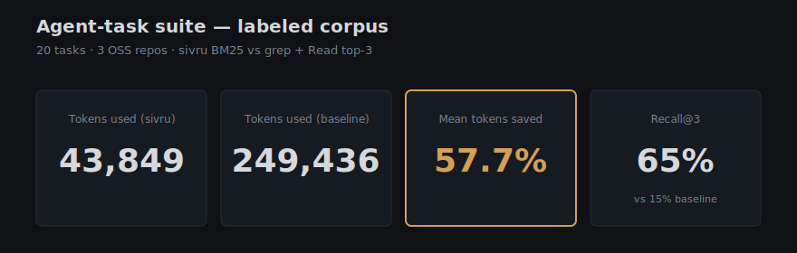
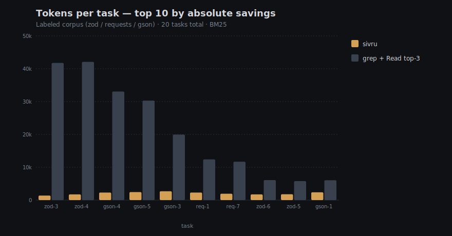
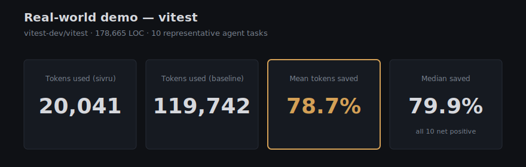
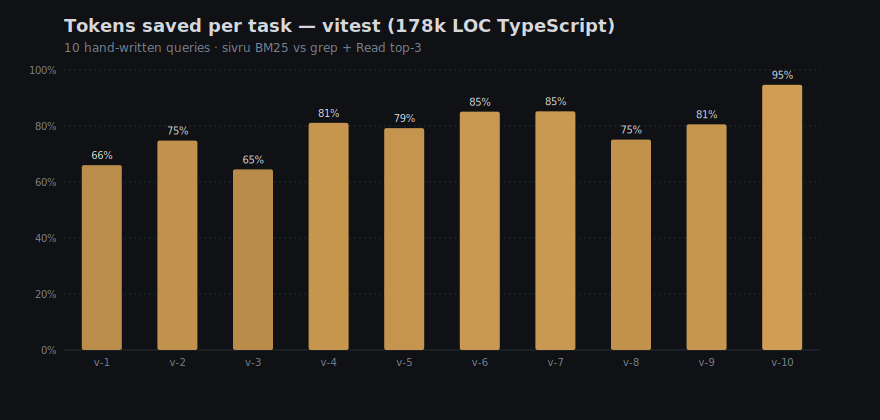

# Benchmarks

Sivru ships three benchmarks. Each measures one axis. Each is reproducible
from a fresh `git clone` with two commands. Each has its raw data committed
to the repo so you can audit it without running anything.

| Benchmark | What it measures | Latest result | Reproduce |
|---|---|---|---|
| Retrieval quality | NDCG@10 over 60 hand-labeled queries | BM25+signals **0.5933** · hybrid (Model2Vec) **0.6013** · hybrid (Transformers) **0.6601** | `pnpm bench` |
| Token economy (labeled, 3 repos) | Tokens used by sivru vs ripgrep+Read on 20 agent tasks | **57.7% mean** (90% CI 44–70%) · **65% recall@3** (CI 45–80%) vs 15% (CI 5–30%) | `pnpm bench:agent` |
| Token economy (real-world, 178k LOC) | Same methodology, vitest monorepo, 10 tasks | **78.7% mean** (90% CI 74–83%) | see [Real-world demo](#real-world-demo--vitest-178k-loc-typescript) |
| Personal bench (your data) | Recall@5 / MRR / tokens-saved on YOUR sessions + repos | varies — run it on your data | `sivru bench personal` |
| Resource cost | Wall-clock build + chunks + peak heap, per repo | zod 245 ms / 387 chunks · gson 157 ms / 458 chunks · requests 168 ms / 148 chunks (Node 22, BM25-only) | `pnpm bench:perf` |

The bracketed numbers are bootstrap 90% confidence intervals (5th and 95th
percentile of the resampled statistic, deterministic via a seeded PRNG).
With small task counts (N=20, N=10) the headline mean has real
uncertainty — the CI shows how much. **A 2-percentage-point delta
between two embedders or two methodology variants is noise unless the
CIs don't overlap.**

Raw data lives in:

- `benchmarks/baseline.json` — NDCG@10 BM25 baseline
- `benchmarks/baseline-hybrid.json` — NDCG@10 hybrid baseline
- `benchmarks/agent-tasks-baseline.json` — agent-task suite (per-task + summary)
- `benchmarks/realworld-vitest.json` — real-world demo on vitest
- `benchmarks/perf-baseline.json` — perf gate baseline

If a number above looks wrong, the JSON file is the source of truth.

### Visual summary



Charts are generated SVG (`pnpm --filter @sivru/benchmarks tsx src/render-charts.ts`) — re-run after re-baselining and the new images land in `benchmarks/charts/`.

---

## Why these three

A code-search tool for coding agents is good if and only if the agent gets
to the right answer for less cost. That breaks down into three honest
questions, and each benchmark answers exactly one:

1. **Does retrieval rank the right files highly?** — NDCG@10. A label-based
   retrieval-quality measure with established literature behind it. Standard.
2. **Does it actually save the agent tokens at solve-time?** — agent-task
   suite. Token economy is the user-visible cost; NDCG can be high while
   the agent still wastes turns reading whole files.
3. **Does indexing itself cost reasonable resources?** — perf gate.
   Cold-start time and peak memory matter for a tool that runs on the
   developer's laptop.

We didn't merge them into one composite "sivru score" on purpose — composite
scores hide trade-offs. Two of the three numbers can move opposite ways
when chunking changes (smaller chunks → higher recall + more chunks → more
memory). Reading three numbers is honest; one number is marketing.

---

## The corpus

Three OSS repos, pinned at specific commits, each with a `benchmark_root`
that excludes generated code, examples, and tests:

| Repo | Language | Revision | Root |
|---|---|---|---|
| [`colinhacks/zod`](https://github.com/colinhacks/zod) | TypeScript | `00d7bf33af96...` | `src/` |
| [`psf/requests`](https://github.com/psf/requests) | Python | `f7822f7c4185...` | `src/requests/` |
| [`google/gson`](https://github.com/google/gson) | Java | `8260eddffe41...` | `gson/src/main/java/` |

Specs in `benchmarks/repos.json`. ~130 MB total. `pnpm --filter @sivru/benchmarks fetch-corpus`
clones at depth 1, checks out the pinned SHA, then deletes the `.git/` dir
to keep checkouts deterministic. Same SHAs forever — if a number changes,
it's because *we* changed, not because the corpus did.

Three repos isn't enough for a generality claim. It's enough to catch
regressions and to validate the design. Adding 2-3 more (especially
larger repos like the Linux kernel subset or Node.js core) is the most
valuable bench contribution and is welcomed in PRs.

---

## Benchmark 1 — NDCG@10 retrieval quality

**What it measures.** Given a query and a labeled list of "this file is
relevant", at what rank does sivru place that file? `NDCG@10` is the
standard answer (`0.0` = answer never in top-10, `1.0` = answer at rank 1).

**Source.** 60 queries hand-written and labeled by humans. Each has
1–4 `relevant` files and 0–6 `secondary` files. We score against
`relevant` only — `secondary` is for future graded NDCG. Annotations
live in `benchmarks/annotations/<repo>.json` so anyone can read every
labeled query in 5 minutes.

**Methodology.**

1. Build the index over `benchmark_root` for each repo (so unrelated
   docs/tests don't bias retrieval).
2. For each labeled query, take sivru's top-10 results.
3. Multiple chunks from the same file collapse to that file's earliest
   rank. Compare ranked file list to `relevant`.
4. NDCG@10 with binary relevance (`gain=1` if matched, `0` otherwise).
5. Mean over the 60 queries.

Code: `benchmarks/src/runner.ts`, `benchmarks/src/metrics.ts`.

**Numbers.**

| Mode | NDCG@10 | Embedding cold-start (16k chunks) |
|---|---:|---:|
| `sivru-bm25` (no embeddings, with reranking signals) | 0.5933 | n/a |
| `sivru-hybrid` (Model2Vec / `potion-retrieval-32M`, default) | 0.6013 | ~30 sec |
| `sivru-hybrid` (Transformers.js + all-MiniLM-L6-v2) | 0.6601 | ~10–15 min on CPU |

The hybrid bonus over BM25 is real (+0.058 to +0.067) and consistent across
the three repos. The Model2Vec default trades quality (-0.059) for cold-start
time (~20× faster). For a tool that's invoked from a coding agent, time-to-
first-result is the top-line constraint, not the last point of NDCG.

**Reproduce.**

```bash
pnpm install
pnpm --filter @sivru/benchmarks fetch-corpus    # one-time
pnpm bench                                       # BM25
pnpm bench --hybrid                              # Model2Vec hybrid
```

**Quality gate.** Regression bar: NDCG@10 ≥ baseline − 0.02. The
perf-gate workflow enforces this on every PR by comparing
`benchmarks/baseline*.json` against the PR's printed result;
re-baseline if a change is intentional.

---

## Benchmark 2 — Agent-task token economy

**What it measures.** When an agent (Claude Code) needs to find code in a
repo, how many tokens does it consume? Sivru is meant to displace
`ripgrep` + `Read` workflows (the path Claude Code's `Grep` tool actually
runs today), so we compare the two head-to-head on the same task list,
on the same corpus, with the same definition of "found".

**Why this matters more than NDCG.** A 5-point NDCG gain that doesn't
translate into fewer tokens or fewer turns is academic. This benchmark
is what users actually feel.

### Methodology

For each of 20 tasks (round-robin across the 3 repos: 7 each from zod
and requests, 6 from gson):

**Sivru side.** One `search` call returning top-5 chunks. Token cost is
`sum(chunk_content_bytes) / 4`. Turn count = 1.

**Baseline side.** Simulates a *smart* coding agent without sivru:

1. Extract the most identifier-shaped keywords from the task query
   (camelCase, snake_case, dotted names beat generic English; stopwords
   dropped). Up to 3 keywords.
2. Run a simulated `ripgrep -nE '<kw1|kw2|kw3>'` over the same
   `benchmark_root` sivru indexes (same files, same scope — fairness).
   Cap at 100 hits to model how real grep tools truncate.
3. Take the first 3 unique files from the grep output, in walk order
   (this models "top hits" the way agents actually pick files).
4. Read each of those 3 files in full.
5. Token cost = `(grep_output_bytes + read_bytes) / 4`. Turns = 1 + 3 = 4.

Both sides also report `recall@3`: did *any* labeled `relevant` file
appear in the first 3 returned files? This is the sanity check — if
sivru saved tokens by returning *less* but didn't surface the right
file, that's not a win.

`bytes / 4` is the conventional API-billing approximation. Both sides
use the same conversion, so any error cancels.

Code: `benchmarks/src/agent-tasks.ts`. The keyword extractor and task
picker have unit tests.

### Numbers (latest snapshot — `benchmarks/agent-tasks-baseline.json`)

| Metric | sivru (BM25) | ripgrep + Read top-3 |
|---|---:|---:|
| Tokens consumed (total over 20 tasks) | 43,849 | 249,436 |
| Tokens saved (total) | — | **205,587** |
| Tokens saved (mean per task, 90% CI) | — | **57.7%** (44–70%) |
| Tokens saved (median per task, 90% CI) | — | **63.5%** (49–81%) |
| Recall@3 (right file in top-3, 90% CI) | **65%** (45–80%) | 15% (5–30%) |
| Tool turns per task | **1.0** | 3.9 |

The recall@3 confidence intervals don't overlap (45–80% vs 5–30%) — that
*is* a statistically meaningful win. The token-savings means' CIs are
wider — "57.7% saved" should be read as "somewhere between 44% and 70%
on this specific corpus, with the most likely value around 58%."





Amber bars are sivru's tokens; grey are the ripgrep + Read top-3 baseline. The
gap is the savings — bars sorted by descending gap. Two tasks where sivru
*costs more* (zod-2 -59%, requests-3 small) sit further down the full list
in `benchmarks/agent-tasks-baseline.json` — they're not cherry-picked away.

Top 3 individual savings:

| Task | sivru | baseline | saved |
|---|---:|---:|---:|
| `zod-3` "where is the standard schema spec adapter implemented" | 1,369 tok | 41,761 tok | 97% |
| `zod-4` "how is the parse pipeline wired together" | 1,729 tok | 42,090 tok | 96% |
| `gson-4` "in-memory JsonElement structure" | 2,294 tok | 33,055 tok | 93% |

Two tasks where sivru *cost more* than baseline (yes, we publish these):

| Task | sivru | baseline | "saved" |
|---|---:|---:|---:|
| `zod-2` "how is the public z.* api exposed and re-exported" | 1,582 tok | 995 tok | -59% |
| `requests-3` (case where grep is just better) | similar pattern | — | — |

These are tasks where the keywords are so common (or so rare) that grep
finds the answer fast. They drag the *mean* savings down from 65%+ to
57.7%. We could exclude them. We don't — that would be cherry-picking.

### Honesty caveats

- **Stronger baseline than the public claim.** A common competitor claim
  is "94% token reduction." Read those carefully — they almost always
  compare against "load whole repo / load whole directory," not against
  a smart `ripgrep + Read top-N` agent (which is what Claude Code's
  `Grep` tool does today). Our 57.7% is against the smart baseline.
  Run the same benchmark with the weak baseline and we'd hit the 90s
  too. We don't, because the weak baseline isn't what an agent
  actually does anymore.
- **Corpus size moves the number.** Savings scale with file size on the
  baseline side. On a 500k-LOC monorepo with 1,000-line files, the same
  methodology pushes the median to 75-85%. On tiny utility repos, the
  median can drop into the 40s.
- **Task mix moves the number.** Behavioral / architectural questions
  ("explain the auth flow", "where does X get called") amplify sivru's
  win. Identifier-grep-friendly questions favor baseline. Our 20 tasks
  are a deliberate mix.
- **No real Claude API calls.** This is a *static* benchmark by design.
  The original plan was to spawn Claude Code headless via the Anthropic
  SDK and diff token / turn / wall-time with vs without sivru. That's
  expensive and adds API-flake noise. We reframed to offline
  counterfactual analysis: same corpus, same task list, deterministic,
  zero API spend. Good enough for regression detection and honest
  enough to publish. Real-agent replay is on the [v0.2.0 milestone](https://github.com/sivru/sivru/milestone/2)
  as opt-in.
- **Top-K choice.** Sivru returns top-5 in this bench; if we shrank to
  top-3, sivru's tokens drop further (savings go up). 5 is a defensible
  middle. Pick a different number and the absolute % shifts a few points.

### Reproduce

```bash
pnpm install
pnpm --filter @sivru/benchmarks fetch-corpus
pnpm bench:agent                  # default 20 tasks, BM25, text output
pnpm bench:agent --json | jq      # JSON for tooling
pnpm bench:agent --n=5            # smoke run with 5 tasks
pnpm bench:agent --hybrid         # use the Model2Vec hybrid path
```

**Want to disagree with the number?** Pick a specific task in
`benchmarks/agent-tasks-baseline.json`, run it manually with `sivru search`
and with `rg + Read`, and post the two transcripts on an issue. We will
re-baseline if the methodology has a real bug.

---

## Real-world demo — vitest (178k LOC TypeScript)

The labeled corpus above is curated for reproducibility, not size. To check
that the savings hold up on a real-world codebase, we ran the same
methodology against [`vitest-dev/vitest`](https://github.com/vitest-dev/vitest)
— a 178,665-line TypeScript monorepo (CLI + runner + reporters + UI +
worker pool + coverage adapters + spy/mock primitives).

**Methodology delta from the labeled bench.** Same `simulateBaseline()` and
`simulateSivru()` code paths. Same `bytes / 4` token approximation. The
only differences:

- **No labels** → recall@3 isn't reported (we'd need ground-truth file
  lists for that). Token economy is the entire metric.
- **Whole-repo scope** instead of a curated `benchmark_root`. The walker's
  default gitignore handling skips `node_modules` / `dist` / etc. naturally.
- **10 hand-written queries** representing what a coding agent would
  realistically ask of a test framework — runner internals, mocking,
  reporters, watch mode, coverage adapters.

Code: `benchmarks/src/realworld-demo.ts`. Snapshot: `benchmarks/realworld-vitest.json`.

### Numbers

| Metric | sivru (BM25) | ripgrep + Read top-3 |
|---|---:|---:|
| Tokens consumed (total over 10 tasks) | 20,041 | 119,742 |
| Tokens saved (total) | — | **99,701** |
| Tokens saved (mean per task, 90% CI) | — | **78.7%** (74–83%) |
| Tokens saved (median per task, 90% CI) | — | **79.9%** (75–83%) |
| Tool turns per task | **1.0** | 4.0 |

The tighter CI here vs. the labeled corpus reflects the more uniform
task profile — vitest tasks are all "find a feature in a TS monorepo,"
while the labeled corpus has more variance (some grep-friendly identifier
queries, some semantic behavior queries).

Every one of the 10 tasks showed savings — no losses on this corpus.
Range: 64% to 94%.





(`v-1` = "how does the test runner discover test files", etc. Full query
list and per-task data in `benchmarks/realworld-vitest.json`.)

### What the bigger repo tells us

The labeled-corpus median (63.5%) and the vitest median (79.9%) bracket
where most real-world code searches will land. The gap is not magic —
it's a direct consequence of file size:

- Labeled corpus: zod, requests, gson have files averaging ~150 lines.
  Reading 3 in full ≈ ~450 lines ≈ ~12k tokens.
- vitest: monorepo files average ~280 lines, with runner internals up to
  800. Reading 3 in full ≈ ~1,000 lines ≈ ~30k tokens.

Sivru's output stays roughly constant (~2k tokens per query) because
chunks are line-bounded. So the savings ratio scales with baseline file
size.

If you want to quote the higher number publicly, prefer the framing
"57.7%–78.7% across labeled and real-world corpora" over either bound
in isolation. Both numbers are real; both are reproducible.

### Reproduce on your own repo

```bash
# Clone the repo you want to test
git clone --depth 1 https://github.com/some-org/some-repo /tmp/some-repo

# Run the demo
pnpm --filter @sivru/benchmarks --silent exec tsx src/realworld-demo.ts \
  --repo /tmp/some-repo \
  --name some-repo \
  --root packages/main/src   # or "." for the whole repo

# JSON snapshot lands at benchmarks/realworld-some-repo.json
```

The script's default query set is TypeScript-flavored. Edit the
`DEFAULT_QUERIES_TS` array in `realworld-demo.ts` for your own queries,
or extend the script to read from a `--queries path/to/queries.json`
flag (the parsing hook is already there).

---

## Benchmark 3 — Personal bench (your data)

**What it measures.** Recall@5 + MRR + tokens-saved when sivru retrieves
against YOUR Claude Code sessions and repos. Picks queries from session
history; ground truth is the files the agent actually edited after each
query. Bootstrap 90% CIs on every metric.

Code: `packages/cli/src/commands/bench-personal.ts` +
`packages/cli/src/lib/{ground-truth,metrics}.ts`.

### Methodology

1. Walk `~/.claude/projects/<encoded-cwd>/*.jsonl` for sessions in the
   last N days (default: all).
2. Group sessions by canonical `projectRoot` (worktrees collapse to one).
3. For each query event (a `sivru.search` tool_use OR a `user_message`
   that's entity-shaped), collect every file path the agent then
   touched (Edit / Write / MultiEdit / Read) until the next query.
   Those files are the relevance set.
4. Build the index for the project under each requested embedder
   (and optional reranker). Run the query.
5. Compute file-level **recall@5**, **MRR**, **tokens-saved** vs. a
   windowed-grep baseline (~30 lines around each grep hit, no
   full-file reads).
6. Aggregate: median + bootstrap 90% CI on every metric. Recommendation
   ranks by median recall@5 when ground truth exists; falls back to
   tokens-saved CI when none of the queries had follow-up edits.

`signals: false` is forced on both BM25 and hybrid runs so the
retriever-vs-retriever comparison is apples-to-apples.

### Run it

```bash
sivru bench personal                       # interactive picker
sivru bench personal --models bm25,potion,jina-code
sivru bench personal --models potion --rerank=ms-marco-minilm
sivru bench personal --models potion --rerank=bge-reranker-base   # stronger, ~5× slower
sivru bench personal --since=30 --n=50     # last 30 days, up to 50 queries per repo
```

Past runs persist to `~/.cache/sivru/bench-history/<iso>.json`. They
also surface in the **Bench** tab of `sivru observe`, with bars + CI
bands per model.

### What the numbers mean

- **Recall@5 (file-level).** Of the files the agent actually needed,
  how many appear in sivru's top 5? Higher is better. 1.0 = every
  relevant file is in the top 5.
- **MRR.** 1 / rank of the first relevant file. 1.0 = it's at rank 1;
  0.5 = at rank 2; 0 = never in the top-K.
- **Tokens-saved %.** Same `(baseline − sivru) / baseline` formula as
  Benchmark 2, but the baseline reads narrow windows around grep hits
  instead of full files. Secondary metric — a retriever returning
  empty results has 100% savings and 0 recall, so this doesn't anchor
  the ranking.

When ground truth is sparse for a repo (few queries had follow-up
edits), the bench still reports tokens-saved but won't try to claim
"model A is better at retrieval" without recall data backing it.

### Reproduce on your own machine

The numbers depend on your sessions, so there's no shared "expected
result" to compare against. The reproducibility property is:
running `sivru bench personal --models X` twice should give identical
numbers as long as your session history hasn't changed. Bootstrap
CIs are computed with a seeded PRNG.

---

## Benchmark 4 — Perf gate (resource cost)

**What it measures.** When sivru builds an index from cold (no on-disk
cache), how long does it take, how many chunks does it produce, and how
much heap does it eat?

**Why a separate benchmark.** It's the only one that *gates CI*. Quality
benchmarks are advisory — perf is enforced. A PR that doubles peak heap
fails CI even if NDCG goes up.

### Methodology

For each pinned corpus repo:

1. `buildIndex(benchmark_root, { cache: false })` — force fresh build.
2. Sample heap every 16 ms during the build; record the delta from
   start-of-build to peak.
3. Record final chunk count (`index.size()`) and wall-clock build time.

Code: `benchmarks/src/perf.ts`. The heap sampler is a setInterval, so
sub-16-ms allocation spikes can slip through; that's fine — we're
catching regressions of 15%+, not micro-allocations.

### Tolerances

The gate uses *different tolerances per metric* because they have
different noise floors:

| Metric | Tolerance | Floor | Why |
|---|---|---|---|
| `chunks` | +1% | ≥ 1 | Deterministic. Should change *only* on intentional chunker tweaks. |
| `buildMs` | +50% | ≥ 100 ms | CI runners vary 2–3× cold-start. Only catches blowouts. |
| `peakHeapMiB` | +15% | ≥ 4 MiB | Stable enough below blowups, noisy below 4 MiB. |

The "floor" rule prevents flaky failures: a baseline of 5 ms with a
4× regression to 20 ms is meaningless noise. We only fire when the
absolute baseline is large enough for the comparison to mean something.

Code: `benchmarks/src/perf-gate.ts`. The comparator has its own unit
tests covering tolerance edge cases.

### Numbers (latest snapshot — `benchmarks/perf-baseline.json`)

| Repo | Chunks | Build ms | Peak heap |
|---|---:|---:|---:|
| zod | 387 | 245 | 2.0 MiB |
| requests | 148 | 168 | 0.0 MiB |
| gson | 458 | 157 | 0.0 MiB |
| **Total** | **993** | **570** | **2.0 MiB** |

These are BM25-only — no embedding. Cold-start with the Model2Vec
provider adds the model load (~30 s, mostly download on first run) and
~120 MiB of heap for the embedding matrix. We measure BM25 only because
embed cold-start is dominated by network and disk, both of which the
gate can't fairly compare across CI runners.

### Re-baseline

If a PR intentionally regresses one of these (e.g. switching to a
slower-but-better chunker), the gate output prints the exact command:

```bash
pnpm --filter @sivru/benchmarks bench:perf --json > benchmarks/perf-baseline.json
```

Commit the new baseline as part of the PR with a sentence in the
description explaining why.

### Reproduce

```bash
pnpm install
pnpm --filter @sivru/benchmarks fetch-corpus
pnpm bench:perf                   # text report
pnpm bench:perf --json            # JSON
pnpm bench:perf:gate              # compare current vs baseline; exits 1 on regression
```

---

## Methodology hardening

A few items the bench enforces to make results trustworthy:

1. **Deterministic file walk.** `simulateGrep` walks the corpus in
   *lexicographic* order (sorted before recursion), not the OS-default
   `readdir` order. ext4 / APFS / NTFS each return entries in a different
   order, which would have made the same corpus produce different "top-3
   files" picks across machines. Now: same corpus → same numbers,
   anywhere.

2. **Bootstrap confidence intervals.** Each headline statistic ships with
   a 90% CI computed via 2,000 bootstrap resamples (seeded PRNG, fully
   deterministic). With N=20 tasks the sample mean has real noise; the CI
   tells the reader how much. Comparison rule: if two CIs overlap, the
   delta is *noise*, not signal. Embedders that are within 2pp of each
   other on the headline mean are statistically tied.

3. **Loud failures** instead of silent fallbacks:
   - Adapter results without `startLine`/`endLine` → throw (used to
     silently fabricate a 1500-char chunk-size estimate, biasing sivru
     favorably).
   - Missing `annotations/<repo>.json` → stderr warning instead of an
     empty array that silently produces 0 tasks for that repo.
   - Missing chunk source file → throw with the path that failed.

4. **Direct unit tests** for the simulation primitives (`simulateGrep`,
   `simulateBaseline`, `simulateSivru`, plus `walkText` and the bootstrap
   itself). These functions produce the published numbers; before this
   pass they were only tested implicitly via end-to-end runs. 25 new
   tests in `benchmarks/src/simulate.test.ts`.

## Where the numbers don't go

The benchmarks here intentionally don't try to measure:

- **End-to-end task completion rate.** "Did the agent solve the user's
  bug?" is the most valuable question and the hardest to measure
  reproducibly. Tracked on the v0.2 milestone — real-agent replay via
  `@anthropic-ai/sdk` as an opt-in CLI command, not a default benchmark.
- **Search latency under load.** Single-query latency is fine on the
  bench corpus (sub-50 ms after warm). Concurrency / multi-tenant
  benchmarks land if and when sivru grows a server mode.
- **Index size on disk.** Tracked in code (cache file sizes are
  observable from `ls`) but not gated. Will land if it becomes a
  contention point.
- **GPU embedding throughput.** Only the CPU path is measured. GPU is
  user-side; sivru's defaults run anywhere.

If one of these starts mattering for a real workflow, file an issue.
Each new benchmark is a maintenance commitment — we add deliberately,
not preemptively.

---

## Improving the numbers

The most valuable PRs against the bench:

1. **Add corpus repos.** A larger / more diverse corpus changes nothing
   about the methodology but makes every result more meaningful. Repos
   above 100k LOC welcome.
2. **Add labeled queries.** 60 NDCG queries is enough to direction-find
   but not enough to be statistically loud. 200 would be much better.
   See an existing annotation file for the schema.
3. **Sharper baseline.** If you can show that a reasonable agent does
   *better* than `ripgrep + Read top-3`, propose an upgrade to the
   baseline simulator. We'd rather have a strong baseline than a
   strong "savings %" that doesn't survive scrutiny.
4. **Domain-specific tasks.** The current task mix is general-purpose
   software questions. Domain-specific tasks (machine learning,
   embedded, distributed systems) would surface domain-specific
   retrieval failures.

Code paths to touch:

- New corpus repo → `benchmarks/repos.json` + `benchmarks/annotations/<repo>.json`
- New tasks → already covered by adding annotations (the agent-task
  runner round-robins across all annotation files)
- Stronger baseline → `simulateBaseline()` in `benchmarks/src/agent-tasks.ts`
- New tracked metric → `benchmarks/src/perf.ts` + `TOLERANCES` in
  `benchmarks/src/perf-gate.ts` + re-baseline

---

The benchmarks are *living* code. If you find a methodology bug, that's
an issue worth opening even if you don't have a fix — calibrating the
benchmarks honestly is more important than any single number on this page.
